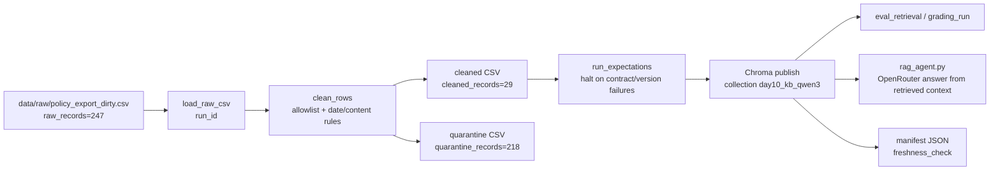

# Kiến trúc pipeline — Lab Day 10

**Nhóm:** Day 10 Lab  
**Cập nhật:** 2026-06-10  
**Run chuẩn:** `sprint123-qwen-final`

## 1. Sơ đồ luồng

Freshness được đo từ `latest_exported_at` trong manifest sau publish. Log, cleaned CSV, quarantine CSV và manifest đều mang cùng `run_id`, ví dụ `sprint123-qwen-final`.

## 2. Ranh giới trách nhiệm

| Thành phần | Input | Output | Owner nhóm |
|------------|-------|--------|------------|
| Ingest | `data/raw/policy_export_dirty.csv` | raw rows + `raw_records` log | Ingestion Owner |
| Transform | raw rows | cleaned rows + quarantine rows | Cleaning Owner |
| Quality | cleaned rows | expectation results + controlled halt | Quality Owner |
| Embed | cleaned CSV | Chroma snapshot collection `day10_kb_qwen3` | Embed Owner |
| Eval / Agent | Chroma collection + questions | eval CSV, grading JSONL, RAG answer | Embed / Agent Owner |
| Monitor | manifest JSON | freshness PASS/WARN/FAIL | Monitoring Owner |

## 3. Idempotency & rerun

`chunk_id` được tạo ổn định từ `doc_id`, text sau clean và sequence publish. Embed dùng Chroma `upsert(ids=chunk_id)` nên rerun cùng dữ liệu không tạo duplicate vector. Trước khi upsert, pipeline lấy toàn bộ id hiện có trong collection và xóa các id không còn trong cleaned run hiện tại; collection vì vậy là snapshot của run mới nhất, không giữ mồi cũ như chunk refund 14 ngày.

Collection `day10_kb_qwen3` tách khỏi collection MiniLM cũ vì Qwen embedding có dimension khác. Embedding provider dùng Ollama local `qwen3-embedding:0.6b` để không phụ thuộc HuggingFace.

## 4. Liên hệ Day 09

Pipeline này làm mới tầng dữ liệu trước khi agent đọc tri thức. `rag_agent.py` mô phỏng flow Day 09: query được embed bằng Ollama, retrieve context từ Chroma, rồi gọi OpenRouter model để trả lời. Smoke test refund trả lời đúng 7 ngày làm việc và context top-k đều từ `policy_refund_v4`.

## 5. Rủi ro đã biết

- Freshness đang FAIL với SLA 24 giờ vì `latest_exported_at=2026-04-11T00:00:00`, trong khi ngày chạy là 2026-06-10.
- OpenRouter agent phụ thuộc key/quota trong `.env`.
- Ollama local phải đang chạy và có model `qwen3-embedding:0.6b`.
- `access_control_sop` đã được allowlist; nếu thêm source mới phải cập nhật cả contract, cleaning rules và expectation coverage.
